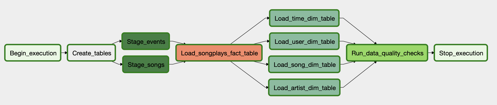
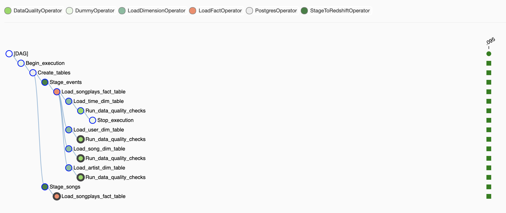

# Data Lake with AWS ElasticMapReduce (EMR)

## Introduction:

* A startup wants to analyze the data they've been collecting on songs and user activity on their new music streaming app.
* The source datasets, that reside in S3 and need to be processed in Amazon Redshift, consist of JSON logs that tell about user activity in the application and JSON metadata about the songs the users listen to.
* As the data quality plays a big part when analyses are executed on top the data warehouse and want to run tests against their datasets after the ETL steps have been executed to catch any discrepancies in the datasets.


## Datasets:

Two datasets were used:

* Song dataset: It is really a subset that contains metadata about a song and the artist of that song and is located in a S3 bucket
* Log dataset: Log files simulating activity logs from a music streaming app and is located in a S3 bucket too.


## DAG


All of the operators and task instances will run SQL statements against the Redshift database. Four operators were used:

* The `stage operator` loads any JSON formatted files from S3 to Amazon Redshift.
* The `dimension and fact operators` utilize a SQL helper class to run data transformations, take as input a SQL statement and target database on which to run the query against.
* The `data quality operator` is used to run checks on the data itself.





### AWS deployment

A terraform module was created to deploy a RDS PostgreSQL instance and a RedShift cluster in private subnets. A bastion EC2 instance was created in order to access them and SSH tunneling was used to run python scripts and Jupyter notebook. You can find the module [here.](https://github.com/ibanmarco/tf-datamodeling-redshift)


### Airflow pipeline:

Docker compose was used to build a basic infrastructure and run the data pipeline. You can create and start the containers by using the following command:

```
docker-compose up -d
```

Once the containers have been created, the port tcp/8080 will be exposed to the host and Airflow will be reachable `http://localhost:8080/`.


### ETL pipeline:

The DAG should manually be enabled and triggered.


